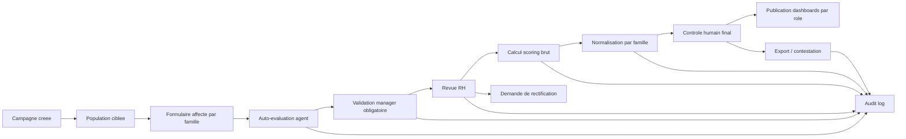
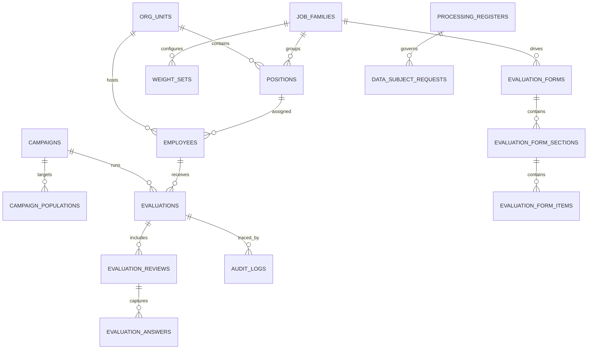
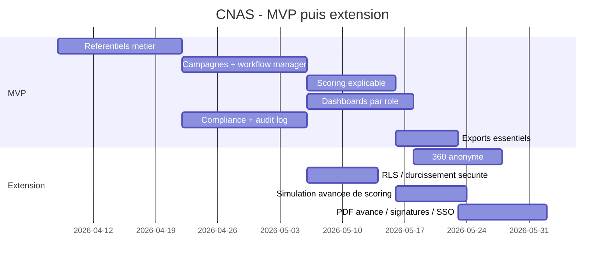

# CNAS - Blueprint de modernisation metier

## 1. Principes verrouilles

- Pas de grille unique CNAS.
- Pas de comparaison inter-metiers.
- Pas de classement global CNAS.
- Pas de scoring opaque.
- Pas de decision 100% automatique.
- Validation manager obligatoire avant consolidation RH.
- Toute action sur les donnees RH/evaluation doit etre tracee.
- Le perimetre organisationnel, les poids, la normalisation, le backend cible, le SSO, l'hebergement et la volumetrie restent configurables.

## 2. Cible fonctionnelle

### 2.1 Referentiels a renforcer

- `org_units`
  - agence
  - structure
  - service
  - unite optionnelle de rattachement
- `job_families`
  - famille metier
  - regle de normalisation
  - politique de scoring par defaut
- `positions`
  - poste
  - niveau hierarchique
  - famille metier
  - service/type d'activite
- `competencies`
  - competences communes
  - competences specifiques par famille
  - echelle Likert configurable
- `weight_sets`
  - poids performance
  - poids competences
  - poids auto-evaluation
  - poids manager
  - poids RH
  - mode de normalisation

### 2.2 Campagnes

- Creation d'une campagne par periode.
- Population cible parametree par:
  - org unit
  - famille de poste
  - niveau
  - statut agent
- Selection du formulaire par famille de poste.
- Activation optionnelle du 360 anonyme.
- Dates distinctes:
  - ouverture auto-evaluation
  - cloture auto-evaluation
  - validation manager
  - revue RH
  - calcul des scores
  - publication des dashboards

### 2.3 Workflow d'evaluation

- Agent:
  - consulte ses objectifs et sa grille
  - saisit son auto-evaluation
  - peut demander rectification
- Manager:
  - complete l'evaluation manager
  - valide ou rejette avec motif obligatoire
  - ne peut pas bypasser le workflow
- RH:
  - controle la conformite de la campagne
  - consolide et arbitre
  - declenche le calcul final
- DPD:
  - consulte le registre des traitements
  - traite export, rectification, contestation
  - supervise l'audit et le profilage
- Admin / Super admin:
  - configurent les referentiels et droits
  - n'accedent pas a une vue identique a celle des RH

### 2.4 Dashboards strictement differencies

- Agent:
  - mes campagnes
  - mon statut de validation
  - details de score explicables
  - demandes de rectification/export/contestation
- Manager:
  - file d'attente d'equipe
  - alertes de validation
  - couverture de campagne
  - ecarts au sein de son seul perimetre
- RH:
  - suivi des campagnes
  - completude par famille
  - ecarts de normalisation
  - demandes de droits des personnes
  - controles de conformite
- Admin:
  - referentiels
  - configurations de scoring
  - imports
  - supervision API / jobs / exports
- Super admin:
  - tenants/environnements
  - politiques globales
  - SSO / secrets / retention / audit transverse

## 3. Scoring non naif

## 3.1 Composition

- `performance_score`
  - provient d'indicateurs quantitatifs configures par famille/poste
  - exemple: volume traite, delai, taux de rejet, presence, qualite de service
- `competency_score`
  - provient d'une evaluation qualitative Likert
  - manager obligatoire
  - auto-evaluation et RH facultatives selon configuration
- `global_score`
  - formule parametree par famille
  - pas de formule hardcodee unique

## 3.2 Exemple de formule parametree

```text
global_score_raw =
  (performance_score * performance_weight)
  + (competency_score * competency_weight)
  + (self_score * self_weight)
  + (rh_adjustment_score * rh_weight)
```

Contraintes:

- Somme des poids = `100`.
- `manager_weight` inclus dans la composante competences ou porte distincte selon la famille.
- Toute correction RH doit etre motivee et auditee.

## 3.3 Normalisation

La normalisation s'applique uniquement a l'interieur d'une population comparable:

- meme famille de poste
- meme niveau si active
- meme campagne
- meme perimetre organisationnel si active

Modes configurables:

- `min_max`
  - utile si les bornes sont stables et comprehen-sibles
- `z_score`
  - utile si on veut corriger la dispersion
- `disabled`
  - si la famille impose une lecture brute explicable

Exemple:

```text
normalized_score = (raw_score - family_min) / (family_max - family_min) * 100
```

ou

```text
normalized_score = 50 + 10 * ((raw_score - family_mean) / family_stddev)
```

Regles:

- aucune normalisation inter-familles
- aucune publication d'un classement general CNAS
- l'algorithme retenu doit etre affichable dans l'interface

## 3.4 Explicabilite obligatoire

Chaque score publie doit exposer:

- formule appliquee
- poids utilises
- source de chaque composante
- methode de normalisation
- date et version du moteur
- dernier controle humain

## 4. Conformite legale a couvrir

## 4.1 Roles et gouvernance

- role `dpd`
  - lecture du registre
  - consultation de l'audit
  - traitement des demandes personnes
  - visa sur les traitements de profilage
- role `rh`
  - exploitation metier
  - pas de suppression silencieuse
- role `manager`
  - validation hierarchique seulement sur son perimetre

## 4.2 Registre des traitements

Champs minimaux:

- finalite
- categorie de personnes
- categorie de donnees
- base legale
- destinataires
- duree de conservation
- mesure de securite
- transfert hors pays
- responsable de traitement
- sous-traitants le cas echeant

## 4.3 Audit log obligatoire

Evenements minimaux:

- collecte
- consultation
- modification
- export
- rectification
- contestation
- chiffrement
- effacement logique

Colonnes minimales:

- `action`
- `actor_user_id`
- `actor_role`
- `entity_type`
- `entity_id`
- `timestamp`
- `ip_address`
- `reason`
- `metadata_json`

## 4.4 Profilage et controle humain

- Le rendement au travail entre dans un cas sensible de profilage.
- L'interface doit afficher:
  - finalite du traitement
  - composantes du score
  - existence d'un controle humain
  - canal de contestation
- Le moteur peut proposer un score mais pas prendre seul une decision RH finale.

## 4.5 Droits des personnes

Fonctions minimales:

- export de mes donnees
- demande de rectification
- contestation d'une evaluation/scoring
- journal des demandes et de leur traitement

## 4.6 Souverainete des donnees

- Aucun transfert hors pays sans autorisation explicite.
- Parametre requis:
  - `data_residency_mode = local_only | approved_transfer`

## 5. Modules fonctionnels et pages React

## 5.1 Modules

### A. Referentiels

- org units
- familles de poste
- postes / niveaux
- competences
- jeux de poids
- regles de normalisation

### B. Campagnes

- creation
- ciblage population
- affectation formulaires
- calendrier
- statut du workflow

### C. Evaluations

- auto-evaluation
- evaluation manager
- revue RH
- 360 anonyme optionnel
- justification / commentaires / pieces jointes optionnelles

### D. Scoring engine

- calcul brut
- normalisation par famille
- versionnage des formules
- simulation avant publication

### E. Compliance

- registre des traitements
- demandes RGPD/18-07/25-11
- controle du profilage
- journal d'audit

### F. Imports / exports

- import CSV employes
- import CSV absences
- import CSV activite/indicateurs
- export CSV/PDF individuel
- export CSV/PDF equipe
- export CSV/PDF RH
- export CSV/PDF audit

## 5.2 Pages React a creer / modifier

### Pages a creer

- `/campaigns`
  - liste + detail campagne
- `/campaigns/:id/workflow`
  - file d'etat par etape
- `/referentials/job-families`
  - familles + regles de scoring
- `/referentials/weight-sets`
  - edition des poids
- `/referentials/forms`
  - formulaires par famille/niveau
- `/compliance/register`
  - registre des traitements
- `/compliance/requests`
  - export / rectification / contestation
- `/audit-log`
  - recherche et filtres
- `/imports`
  - CSV employes/absences/activite
- `/exports`
  - exports metier

### Pages a modifier

- `/login`
  - rester simple
  - garder acces rapide aux roles demo
- `/employee`
  - afficher score explicable, statut de validation et droits
- `/manager`
  - afficher validation obligatoire, file d'attente d'equipe, alertes
- `/hr`
  - afficher campagne, conformite, normalisation, demandes, audit
- `/admin`
  - afficher referentiels, imports, configs, supervision
- `/evaluations`
  - separer onglets auto / manager / RH / 360
- `/rankings`
  - remplacer par vue de comparaison limitee a une famille/perimetre, jamais globale

## 6. Schema PostgreSQL cible

Tous les IDs metier en `UUID`. Les champs d'audit et de retention restent obligatoires.

```sql
create table org_units (
  id uuid primary key,
  parent_id uuid null references org_units(id),
  unit_type varchar(30) not null,
  code varchar(50) not null unique,
  name varchar(255) not null,
  is_active boolean not null default true,
  created_at timestamptz not null default now(),
  updated_at timestamptz not null default now()
);

create table job_families (
  id uuid primary key,
  code varchar(50) not null unique,
  name varchar(255) not null,
  normalization_method varchar(20) not null default 'min_max',
  scoring_policy_version varchar(30) not null,
  created_at timestamptz not null default now(),
  updated_at timestamptz not null default now()
);

create table positions (
  id uuid primary key,
  job_family_id uuid not null references job_families(id),
  org_unit_id uuid null references org_units(id),
  code varchar(50) not null unique,
  title varchar(255) not null,
  hierarchy_level smallint not null,
  is_active boolean not null default true
);

create table competencies (
  id uuid primary key,
  code varchar(50) not null unique,
  label varchar(255) not null,
  competency_type varchar(30) not null,
  likert_scale smallint not null default 5,
  is_active boolean not null default true
);

create table weight_sets (
  id uuid primary key,
  job_family_id uuid not null references job_families(id),
  position_id uuid null references positions(id),
  label varchar(255) not null,
  performance_weight numeric(5,2) not null,
  competency_weight numeric(5,2) not null,
  self_weight numeric(5,2) not null default 0,
  rh_weight numeric(5,2) not null default 0,
  manager_required boolean not null default true,
  created_at timestamptz not null default now(),
  updated_at timestamptz not null default now()
);

create table campaigns (
  id uuid primary key,
  code varchar(50) not null unique,
  label varchar(255) not null,
  start_date date not null,
  end_date date not null,
  publication_date date null,
  status varchar(20) not null,
  config_json jsonb not null default '{}'::jsonb
);

create table campaign_populations (
  id uuid primary key,
  campaign_id uuid not null references campaigns(id) on delete cascade,
  org_unit_id uuid null references org_units(id),
  job_family_id uuid null references job_families(id),
  position_id uuid null references positions(id)
);

create table employees (
  id uuid primary key,
  user_id uuid null,
  org_unit_id uuid not null references org_units(id),
  position_id uuid not null references positions(id),
  manager_employee_id uuid null references employees(id),
  matricule varchar(50) not null unique,
  full_name varchar(255) not null,
  status varchar(20) not null,
  metadata_json jsonb not null default '{}'::jsonb
);

create table evaluation_forms (
  id uuid primary key,
  job_family_id uuid not null references job_families(id),
  hierarchy_level smallint null,
  label varchar(255) not null,
  version varchar(30) not null,
  is_active boolean not null default true
);

create table evaluation_form_sections (
  id uuid primary key,
  form_id uuid not null references evaluation_forms(id) on delete cascade,
  section_type varchar(30) not null,
  label varchar(255) not null,
  weight numeric(5,2) not null
);

create table evaluation_form_items (
  id uuid primary key,
  section_id uuid not null references evaluation_form_sections(id) on delete cascade,
  competency_id uuid null references competencies(id),
  item_type varchar(30) not null,
  label varchar(255) not null,
  weight numeric(5,2) not null,
  score_min numeric(5,2) not null default 0,
  score_max numeric(5,2) not null default 5,
  config_json jsonb not null default '{}'::jsonb
);

create table evaluations (
  id uuid primary key,
  campaign_id uuid not null references campaigns(id),
  employee_id uuid not null references employees(id),
  form_id uuid not null references evaluation_forms(id),
  weight_set_id uuid not null references weight_sets(id),
  workflow_status varchar(30) not null,
  performance_score_raw numeric(6,2) null,
  competency_score_raw numeric(6,2) null,
  global_score_raw numeric(6,2) null,
  global_score_normalized numeric(6,2) null,
  scoring_trace jsonb not null default '{}'::jsonb,
  last_human_review_by uuid null,
  last_human_review_at timestamptz null,
  created_at timestamptz not null default now(),
  updated_at timestamptz not null default now(),
  unique (campaign_id, employee_id)
);

create table evaluation_reviews (
  id uuid primary key,
  evaluation_id uuid not null references evaluations(id) on delete cascade,
  review_type varchar(20) not null,
  reviewer_user_id uuid not null,
  status varchar(20) not null,
  submitted_at timestamptz null,
  validated_at timestamptz null,
  reason text null
);

create table evaluation_answers (
  id uuid primary key,
  review_id uuid not null references evaluation_reviews(id) on delete cascade,
  form_item_id uuid not null references evaluation_form_items(id),
  score numeric(6,2) null,
  comment text null,
  unique (review_id, form_item_id)
);

create table processing_registers (
  id uuid primary key,
  processing_code varchar(50) not null unique,
  purpose text not null,
  legal_basis text not null,
  data_categories jsonb not null,
  recipients jsonb not null,
  retention_period text not null,
  cross_border_transfer boolean not null default false,
  safeguards text null,
  owner_user_id uuid null,
  dpd_user_id uuid null
);

create table data_subject_requests (
  id uuid primary key,
  requester_employee_id uuid null references employees(id),
  request_type varchar(20) not null,
  status varchar(20) not null,
  target_entity_type varchar(50) null,
  target_entity_id uuid null,
  submitted_at timestamptz not null default now(),
  closed_at timestamptz null,
  resolution_note text null
);

create table audit_logs (
  id uuid primary key,
  actor_user_id uuid null,
  actor_role varchar(30) null,
  action varchar(50) not null,
  entity_type varchar(50) not null,
  entity_id uuid null,
  reason text null,
  ip_address inet null,
  metadata_json jsonb not null default '{}'::jsonb,
  created_at timestamptz not null default now()
);
```

### Index et contraintes

- `index evaluations (campaign_id, workflow_status)`
- `index evaluations (employee_id, campaign_id)`
- `index evaluation_reviews (evaluation_id, review_type, status)`
- `index audit_logs (entity_type, entity_id, created_at desc)`
- `index audit_logs (actor_user_id, created_at desc)`
- `gin index audit_logs(metadata_json)`
- `gin index evaluations(scoring_trace)`
- contrainte check sur somme des poids a `100`
- contrainte check sur `global_score_normalized between 0 and 100` si mode min-max

### RLS optionnel

RLS recommande si PostgreSQL est expose directement ou via BFF:

- agent: lecture de ses propres evaluations et demandes
- manager: lecture/validation de son equipe seulement
- RH: lecture sur perimetre RH assigne
- DPD: lecture audit + registre + demandes
- admin: lecture/configuration sans acces indiscrimine aux donnees sensibles si non necessaire

## 7. API REST cible

OpenAPI a exposer en versionnee: `/api/v1`.

## 7.1 Auth

- `POST /auth/login`
- `POST /auth/refresh`
- `GET /auth/me`
- `POST /auth/logout`
- `GET /auth/permissions`

## 7.2 Referentiels

- `GET /org-units`
- `POST /org-units`
- `GET /job-families`
- `POST /job-families`
- `GET /positions`
- `GET /competencies`
- `GET /weight-sets`
- `POST /weight-sets`
- `GET /evaluation-forms`
- `POST /evaluation-forms`

## 7.3 Campagnes

- `GET /campaigns`
- `POST /campaigns`
- `GET /campaigns/{id}`
- `PATCH /campaigns/{id}`
- `POST /campaigns/{id}/open`
- `POST /campaigns/{id}/close`
- `GET /campaigns/{id}/workflow`

## 7.4 Evaluations

- `GET /evaluations`
- `POST /evaluations`
- `GET /evaluations/{id}`
- `PATCH /evaluations/{id}`
- `POST /evaluations/{id}/self-submit`
- `POST /evaluations/{id}/manager-validate`
- `POST /evaluations/{id}/manager-reject`
- `POST /evaluations/{id}/rh-review`
- `POST /evaluations/{id}/request-rectification`
- `POST /evaluations/{id}/contest`

## 7.5 Scoring

- `POST /scoring/simulate`
- `POST /scoring/evaluations/{id}/calculate`
- `POST /scoring/campaigns/{id}/calculate`
- `GET /scoring/evaluations/{id}/explain`
- `GET /scoring/policies`

## 7.6 Imports / exports

- `POST /imports/employees`
- `POST /imports/absences`
- `POST /imports/activity`
- `GET /exports/evaluations.csv`
- `GET /exports/evaluations/{id}.pdf`
- `GET /exports/team/{managerId}.pdf`
- `GET /exports/hr/campaign/{campaignId}.csv`
- `GET /exports/audit.csv`

## 7.7 Compliance

- `GET /compliance/processing-register`
- `POST /compliance/processing-register`
- `GET /compliance/requests`
- `POST /compliance/requests/export`
- `POST /compliance/requests/rectification`
- `POST /compliance/requests/contest`
- `GET /compliance/profiling-disclosures`

## 7.8 Audit

- `GET /audit-logs`
- `GET /audit-logs/{id}`
- `POST /audit-logs/export`

## 7.9 Exemple OpenAPI minimal

```yaml
openapi: 3.1.0
info:
  title: CNAS Evaluation API
  version: 1.0.0
paths:
  /api/v1/evaluations/{id}/manager-validate:
    post:
      summary: Validation hierarchique obligatoire
      parameters:
        - in: path
          name: id
          required: true
          schema:
            type: string
            format: uuid
      requestBody:
        required: true
        content:
          application/json:
            schema:
              type: object
              required: [reason]
              properties:
                reason:
                  type: string
      responses:
        "200":
          description: Evaluation validee par le manager
  /api/v1/scoring/evaluations/{id}/explain:
    get:
      summary: Restitue la formule, les poids et la normalisation appliques
      responses:
        "200":
          description: Explication du score
```

## 8. Diagrammes Mermaid

### Workflow complet



### ER simplifie



### Gantt de deploiement



## 9. Exemples de dashboards React

## 9.1 Dataset fictif

```ts
export const hrCampaignDataset = {
  coverage: [
    { family: "Agences", target: 120, completed: 94 },
    { family: "Paiement", target: 60, completed: 42 },
    { family: "Sanitaire", target: 38, completed: 31 },
    { family: "Social", target: 44, completed: 36 },
  ],
  workflow: [
    { step: "Auto", value: 203 },
    { step: "Manager", value: 156 },
    { step: "RH", value: 88 },
    { step: "Publie", value: 61 },
  ],
  compliance: {
    auditEvents24h: 1248,
    pendingRequests: 5,
    profilingControls: 3,
    registerEntries: 7,
  },
};
```

## 9.2 Exemple React + Recharts

```tsx
import {
  BarChart,
  Bar,
  CartesianGrid,
  ResponsiveContainer,
  Tooltip,
  XAxis,
  YAxis,
} from "recharts";

export function HRCoverageChart({ data }: { data: Array<{ family: string; target: number; completed: number }> }) {
  return (
    <ResponsiveContainer width="100%" height={280}>
      <BarChart data={data}>
        <CartesianGrid strokeDasharray="3 3" />
        <XAxis dataKey="family" />
        <YAxis />
        <Tooltip />
        <Bar dataKey="target" fill="#94a3b8" radius={[8, 8, 0, 0]} />
        <Bar dataKey="completed" fill="#0f3d91" radius={[8, 8, 0, 0]} />
      </BarChart>
    </ResponsiveContainer>
  );
}
```

## 10. MVP puis extension

## 10.1 MVP

- referentiels metier
- campagnes
- workflow auto -> manager -> RH
- scoring explicable par famille
- normalisation configurable
- dashboards differencies par role
- audit log obligatoire
- registre des traitements
- export individuel / equipe / audit
- import CSV employes / absences / activite

## 10.2 Extension

- 360 anonyme
- RLS
- simulation de scoring multi-scenarios
- connecteur SSO
- signatures / visa numerique
- retention automatisee
- alertes compliance avancees

## 11. Ecarts immediats constates dans l'existant

- le module `rankings` est contraire au principe "pas de classement general CNAS"
- les dashboards actuels restent trop proches structurellement
- le scoring actuel dans Django n'explique pas encore la normalisation
- le role `dpd` est absent
- le registre des traitements et l'audit legal complet sont absents
- les droits export / rectification / contestation ne sont pas modelises

## 12. Hypotheses volontairement non figees

Les elements suivants restent a parametrer et ne doivent pas etre hardcodes:

- backend definitif au-dela du Django actuel
- PostgreSQL en mode simple ou avec RLS active
- SSO exact
- volumetrie cible
- perimetre organisationnel exact
- familles de poste et niveaux exacts
- formule de normalisation retenue par famille
- retention exacte par type de donnees
